# 在线考试系统设计文档

## 1. 概述

### 1.1 项目背景
本项目旨在开发一个功能完整的桌面在线考试系统,支持题库管理、智能组卷、在线考试、自动评分、成绩统计等核心功能,满足教育机构和企业的考试需求。

### 1.2 项目目标
- 提供完整的题库管理能力,支持多种题型
- 实现灵活的组卷策略,支持固定组卷和随机抽题
- 提供流畅的考试体验,支持自动计时、答案保存等功能
- 实现客观题自动评分和主观题人工评分
- 提供多维度的数据统计和报表分析
- 确保数据安全和系统稳定性

### 1.3 系统定位
- 系统类型: 桌面应用程序(单机版)
- 目标用户: 教育机构教师、培训机构、企业HR部门
- 使用场景: 课程考试、培训考核、招聘测评等

## 2. 技术架构

### 2.1 技术栈选型

| 技术领域 | 选型方案 | 说明 |
|---------|---------|------|
| 开发框架 | WPF + .NET 6/7/8 | 成熟的桌面应用开发框架 |
| 架构模式 | MVVM | 使用 CommunityToolkit.Mvvm 或 Prism |
| 数据库 | SQLite | 轻量级嵌入式数据库,适合单机应用 |
| ORM框架 | Entity Framework Core | 强类型数据访问,支持迁移 |
| 依赖注入 | Microsoft.Extensions.DependencyInjection | .NET 官方DI容器 |
| 日志框架 | Serilog | 结构化日志,支持多种输出目标 |
| Excel处理 | EPPlus 或 NPOI | 题目导入导出 |
| PDF生成 | iTextSharp 或 QuestPDF | 试卷和成绩单导出 |
| 图表组件 | LiveCharts 或 OxyPlot | 数据可视化 |

### 2.2 架构模式

系统采用经典的分层架构结合MVVM模式:

```
graph TB
    subgraph "表现层 Presentation Layer"
        View[View 视图层]
        ViewModel[ViewModel 视图模型层]
    end
    
    subgraph "业务逻辑层 Business Logic Layer"
        Service[Service 服务层]
        Domain[Domain 领域模型层]
    end
    
    subgraph "数据访问层 Data Access Layer"
        Repository[Repository 仓储层]
        DbContext[DbContext 数据上下文]
    end
    
    subgraph "基础设施层 Infrastructure Layer"
        Common[Common 公共组件]
        Utils[Utils 工具类]
    end
    
    View -->|数据绑定| ViewModel
    ViewModel -->|调用| Service
    Service -->|业务逻辑| Domain
    Service -->|数据操作| Repository
    Repository -->|ORM映射| DbContext
    Service -->|使用| Common
    Service -->|使用| Utils
```

### 2.3 项目结构

项目按职责划分为以下模块:

| 项目/层级 | 职责说明 |
|----------|----------|
| ExamSystem.UI | WPF视图层,包含所有xaml页面和用户控件 |
| ExamSystem.ViewModels | 视图模型层,实现UI逻辑和数据绑定 |
| ExamSystem.Services | 业务服务层,封装核心业务逻辑 |
| ExamSystem.Domain | 领域模型层,定义实体、枚举、DTO等 |
| ExamSystem.Repository | 数据访问层,实现数据持久化 |
| ExamSystem.Infrastructure | 基础设施层,提供公共组件和工具类 |

### 2.4 核心设计原则

- **单一职责原则**: 每个类只负责一个功能领域
- **依赖倒置原则**: 面向接口编程,通过依赖注入管理依赖
- **开闭原则**: 对扩展开放,对修改关闭
- **MVVM分离**: View不包含业务逻辑,ViewModel不依赖具体View
- **事务一致性**: 关键业务操作使用数据库事务保证数据完整性

## 3. 数据模型设计

### 3.1 核心实体关系


### 3.2 数据表详细设计

#### 3.2.1 用户表 (Users)

| 字段名 | 类型 | 约束 | 说明 |
|-------|------|------|------|
| UserId | int | PK, 自增 | 用户唯一标识 |
| Username | nvarchar(50) | NOT NULL, UNIQUE | 用户名 |
| PasswordHash | nvarchar(256) | NOT NULL | 密码哈希值(使用BCrypt或SHA256) |
| RealName | nvarchar(50) | NULL | 真实姓名 |
| Role | nvarchar(20) | NOT NULL | 角色(Admin/Teacher/Student) |
| Email | nvarchar(100) | NULL | 邮箱 |
| Phone | nvarchar(20) | NULL | 手机号 |
| IsActive | bit | NOT NULL, DEFAULT 1 | 是否激活 |
| CreatedAt | datetime | NOT NULL | 创建时间 |
| LastLoginAt | datetime | NULL | 最后登录时间 |

#### 3.2.2 题库表 (QuestionBanks)

| 字段名 | 类型 | 约束 | 说明 |
|-------|------|------|------|
| BankId | int | PK, 自增 | 题库唯一标识 |
| Name | nvarchar(100) | NOT NULL | 题库名称 |
| Description | nvarchar(500) | NULL | 题库描述 |
| Category | nvarchar(50) | NULL | 分类 |
| CreatorId | int | FK → Users | 创建者ID |
| IsPublic | bit | NOT NULL, DEFAULT 0 | 是否公开 |
| CreatedAt | datetime | NOT NULL | 创建时间 |
| UpdatedAt | datetime | NULL | 更新时间 |

#### 3.2.3 题目表 (Questions)

| 字段名 | 类型 | 约束 | 说明 |
|-------|------|------|------|
| QuestionId | int | PK, 自增 | 题目唯一标识 |
| BankId | int | FK → QuestionBanks | 所属题库ID |
| QuestionType | nvarchar(20) | NOT NULL | 题型(SingleChoice/MultipleChoice/TrueFalse/FillBlank/Subjective) |
| Content | ntext | NOT NULL | 题目内容 |
| Answer | ntext | NOT NULL | 正确答案 |
| Analysis | ntext | NULL | 题目解析 |
| DefaultScore | decimal(5,2) | NOT NULL | 默认分值 |
| Difficulty | nvarchar(20) | NOT NULL | 难度(Easy/Medium/Hard) |
| Tags | nvarchar(200) | NULL | 标签(逗号分隔) |
| CreatedAt | datetime | NOT NULL | 创建时间 |
| UpdatedAt | datetime | NULL | 更新时间 |

#### 3.2.4 选项表 (Options)

| 字段名 | 类型 | 约束 | 说明 |
|-------|------|------|------|
| OptionId | int | PK, 自增 | 选项唯一标识 |
| QuestionId | int | FK → Questions | 所属题目ID |
| Content | nvarchar(500) | NOT NULL | 选项内容 |
| IsCorrect | bit | NOT NULL | 是否正确答案 |
| OrderIndex | int | NOT NULL | 排序索引 |

#### 3.2.5 试卷表 (ExamPapers)

| 字段名 | 类型 | 约束 | 说明 |
|-------|------|------|------|
| PaperId | int | PK, 自增 | 试卷唯一标识 |
| Name | nvarchar(100) | NOT NULL | 试卷名称 |
| Description | nvarchar(500) | NULL | 试卷描述 |
| TotalScore | decimal(6,2) | NOT NULL | 总分 |
| PassScore | decimal(6,2) | NOT NULL | 及格分 |
| Duration | int | NOT NULL | 考试时长(分钟) |
| PaperType | nvarchar(20) | NOT NULL | 试卷类型(Fixed/Random/Mixed) |
| RandomConfig | ntext | NULL | 随机组卷配置(JSON格式) |
| CreatorId | int | FK → Users | 创建者ID |
| Status | nvarchar(20) | NOT NULL | 状态(Draft/Active/Archived) |
| StartTime | datetime | NULL | 开始时间 |
| EndTime | datetime | NULL | 结束时间 |
| CreatedAt | datetime | NOT NULL | 创建时间 |
| UpdatedAt | datetime | NULL | 更新时间 |

#### 3.2.6 试卷题目关联表 (PaperQuestions)

| 字段名 | 类型 | 约束 | 说明 |
|-------|------|------|------|
| Id | int | PK, 自增 | 关联记录ID |
| PaperId | int | FK → ExamPapers | 试卷ID |
| QuestionId | int | FK → Questions | 题目ID |
| OrderIndex | int | NOT NULL | 题目顺序 |
| Score | decimal(5,2) | NOT NULL | 该题分值 |

#### 3.2.7 考试记录表 (ExamRecords)

| 字段名 | 类型 | 约束 | 说明 |
|-------|------|------|------|
| RecordId | int | PK, 自增 | 记录唯一标识 |
| UserId | int | FK → Users | 考生ID |
| PaperId | int | FK → ExamPapers | 试卷ID |
| StartTime | datetime | NOT NULL | 开始时间 |
| EndTime | datetime | NULL | 结束时间 |
| SubmitTime | datetime | NULL | 提交时间 |
| Status | nvarchar(20) | NOT NULL | 状态(InProgress/Submitted/Graded) |
| TotalScore | decimal(6,2) | NULL | 总得分 |
| ObjectiveScore | decimal(6,2) | NULL | 客观题得分 |
| SubjectiveScore | decimal(6,2) | NULL | 主观题得分 |
| IsPassed | bit | NULL | 是否通过 |
| AbnormalBehaviors | ntext | NULL | 异常行为记录(JSON) |
| CreatedAt | datetime | NOT NULL | 创建时间 |

#### 3.2.8 答题记录表 (AnswerRecords)

| 字段名 | 类型 | 约束 | 说明 |
|-------|------|------|------|
| AnswerId | int | PK, 自增 | 答题记录ID |
| RecordId | int | FK → ExamRecords | 考试记录ID |
| QuestionId | int | FK → Questions | 题目ID |
| UserAnswer | ntext | NULL | 考生答案 |
| Score | decimal(5,2) | NULL | 得分 |
| IsCorrect | bit | NULL | 是否正确 |
| IsGraded | bit | NOT NULL, DEFAULT 0 | 是否已评分 |
| GraderId | int | NULL, FK → Users | 评分人ID |
| GradeComment | nvarchar(500) | NULL | 评分评语 |
| AnswerTime | datetime | NULL | 答题时间 |

### 3.3 枚举定义

#### 3.3.1 题型枚举 (QuestionType)

| 枚举值 | 说明 | 特性 |
|--------|------|------|
| SingleChoice | 单选题 | 客观题,自动评分 |
| MultipleChoice | 多选题 | 客观题,自动评分,支持部分得分 |
| TrueFalse | 判断题 | 客观题,自动评分 |
| FillBlank | 填空题 | 客观题,支持精确匹配和模糊匹配 |
| Subjective | 主观题 | 主观题,需人工评分 |

#### 3.3.2 难度枚举 (Difficulty)

| 枚举值 | 说明 | 权重系数 |
|--------|------|----------|
| Easy | 简单 | 1.0 |
| Medium | 中等 | 1.5 |
| Hard | 困难 | 2.0 |

#### 3.3.3 用户角色 (UserRole)

| 枚举值 | 说明 | 权限范围 |
|--------|------|----------|
| Admin | 管理员 | 系统管理、用户管理、所有功能 |
| Teacher | 教师 | 题库管理、组卷、评分、成绩查看 |
| Student | 学生 | 参加考试、查看成绩 |

#### 3.3.4 试卷类型 (PaperType)

| 枚举值 | 说明 |
|--------|------|
| Fixed | 固定试卷 - 所有考生题目相同 |
| Random | 随机试卷 - 按规则随机抽题 |
| Mixed | 混合试卷 - 部分固定+部分随机 |

#### 3.3.5 考试状态 (ExamStatus)

| 枚举值 | 说明 |
|--------|------|
| InProgress | 考试进行中 |
| Submitted | 已提交,待评分 |
| Graded | 已评分 |
| Timeout | 超时自动提交 |

## 4. 核心业务设计

### 4.1 题库管理模块

#### 4.1.1 功能概述
题库管理模块负责题库和题目的全生命周期管理,包括创建、编辑、删除、查询、导入导出等功能。

#### 4.1.2 题库管理流程

```mermaid
flowchart TD
    Start([进入题库管理]) --> ListBanks[展示题库列表]
    ListBanks --> Choice{操作选择}
    
    Choice -->|新建| CreateBank[输入题库信息]
    CreateBank --> ValidateBank{验证数据}
    ValidateBank -->|通过| SaveBank[保存到数据库]
    ValidateBank -->|失败| CreateBank
    SaveBank --> ListBanks
    
    Choice -->|编辑| SelectBank[选择题库]
    SelectBank --> EditBank[修改题库信息]
    EditBank --> SaveBank
    
    Choice -->|删除| SelectBank2[选择题库]
    SelectBank2 --> CheckRelation{检查关联题目}
    CheckRelation -->|有题目| ConfirmCascade[确认级联删除]
    CheckRelation -->|无题目| DeleteBank[删除题库]
    ConfirmCascade -->|确认| DeleteBank
    ConfirmCascade -->|取消| ListBanks
    DeleteBank --> ListBanks
    
    Choice -->|查看统计| ShowStats[展示题库统计信息]
    ShowStats --> ListBanks
```



#### 4.1.3 题目管理流程

```mermaid
flowchart TD
    Start([进入题目管理]) --> SelectBank[选择题库]
    SelectBank --> ListQuestions[展示题目列表]
    
    ListQuestions --> Filter[应用筛选条件]
    Filter --> ||题型/难度/标签|| Display[显示筛选结果]
    
    Display --> Action{操作选择}
    
    Action -->|新增| SelectType[选择题型]
    SelectType --> OpenEditor[打开对应编辑器]
    OpenEditor --> InputContent[输入题目内容]
    InputContent --> InputAnswer[输入答案]
    InputAnswer --> InputOptions[输入选项<选择题>]
    InputOptions --> SetMetadata[设置分值/难度/标签]
    SetMetadata --> ValidateQuestion{验证题目}
    ValidateQuestion -->|通过| SaveQuestion[保存题目]
    ValidateQuestion -->|失败| InputContent
    SaveQuestion --> ListQuestions
    
    Action -->|编辑| SelectQuestion[选择题目]
    SelectQuestion --> LoadQuestion[加载题目数据]
    LoadQuestion --> InputContent
    
    Action -->|删除| SelectQuestion2[选择题目]
    SelectQuestion2 --> CheckUsage{检查是否被引用}
    CheckUsage -->|已引用| ShowWarning[提示警告]
    CheckUsage -->|未引用| ConfirmDelete[确认删除]
    ShowWarning --> ConfirmDelete
    ConfirmDelete -->|确认| DeleteQuestion[删除题目]
    ConfirmDelete -->|取消| ListQuestions
    DeleteQuestion --> ListQuestions
    
    Action -->|导入| SelectFormat[选择文件格式]
    SelectFormat --> UploadFile[上传文件]
    UploadFile --> ParseFile[解析文件内容]
    ParseFile --> ValidateData{验证数据}
    ValidateData -->|通过| ImportData[批量导入]
    ValidateData -->|失败| ShowErrors[显示错误信息]
    ShowErrors --> ListQuestions
    ImportData --> ShowResult[显示导入结果]
    ShowResult --> ListQuestions
    
    Action -->|导出| SelectExportFormat[选择导出格式]
    SelectExportFormat --> ApplyFilter[应用筛选条件]
    ApplyFilter --> GenerateFile[生成导出文件]
    GenerateFile --> DownloadFile[下载文件]
    DownloadFile --> ListQuestions
```

#### 4.1.4 题目验证规则

| 验证项 | 规则 |
|--------|------|
| 题目内容 | 不能为空,长度不超过5000字符 |
| 题型 | 必须是有效的枚举值 |
| 答案 | 不能为空 |
| 单选题选项 | 至少2个选项,最多10个,有且仅有一个正确答案 |
| 多选题选项 | 至少3个选项,最多10个,至少2个正确答案 |
| 判断题答案 | 只能是“正确”或“错误” |
| 填空题答案 | 支持多个答案(用端口分隔),每个答案不超过200字符 |
| 主观题答案 | 参考答案,长度不超过10000字符 |
| 分值 | 大于0,不超过100 |
| 难度 | 必须是有效的枚举值 |
| 标签 | 可选,多个标签用逗号分隔 |

#### 4.1.5 导入导出格式

**Excel 导入格式**

| 列名 | 类型 | 必填 | 说明 |
|------|------|------|------|
| 题型 | 文本 | 是 | 单选/多选/判断/填空/主观 |
| 题目内容 | 文本 | 是 | 题目描述 |
| 选项A | 文本 | 条件 | 选择题必填 |
| 选项B | 文本 | 条件 | 选择题必填 |
| 选项C | 文本 | 否 | 选择题可选 |
| 选项D | 文本 | 否 | 选择题可选 |
| 正确答案 | 文本 | 是 | 选择题填字母A/B/C/D,多选填ABCD,其他填具体内容 |
| 题目解析 | 文本 | 否 | 答案解析 |
| 分值 | 数字 | 是 | 默认分值 |
| 难度 | 文本 | 是 | 简单/中等/困难 |
| 标签 | 文本 | 否 | 多个标签用逗号分隔 |

**JSON 导入导出格式结构**

使用JSON数组格式,每个题目为一个对象,包含字段:
- questionType: 题型
- content: 题目内容
- options: 选项数组(仅选择题)
- answer: 答案
- analysis: 解析
- score: 分值
- difficulty: 难度
- tags: 标签数组

### 4.2 组卷管理模块

#### 4.2.1 功能概述
组卷模块支持三种组卷模式:固定组卷、随机组卷和混合组卷,满足不同场景的考试需求。

#### 4.2.2 固定组卷流程

```mermaid
flowchart TD
    Start([创建固定试卷]) --> InputBasicInfo[输入试卷基本信息]
    InputBasicInfo --> ||名称/时长/总分|| SelectQuestions[进入选题界面]
    
    SelectQuestions --> BrowseBank[浏览题库]
    BrowseBank --> FilterQuestions[筛选题目]
    FilterQuestions --> AddQuestion[添加题目到试卷]
    AddQuestion --> SetScore[设置题目分值]
    SetScore --> CheckMore{继续添加?}
    
    CheckMore -->|是| BrowseBank
    CheckMore -->|否| AdjustOrder[调整题目顺序]
    
    AdjustOrder --> ValidatePaper{验证试卷}
    ValidatePaper -->|失败| ShowValidationErrors[显示验证错误]
    ShowValidationErrors --> SelectQuestions
    
    ValidatePaper -->|通过| PreviewPaper[预览试卷]
    PreviewPaper --> ConfirmSave{确认保存?}
    
    ConfirmSave -->|是| SavePaper[保存试卷]
    ConfirmSave -->|否| SelectQuestions
    SavePaper --> End([完成])
```

#### 4.2.3 随机组卷流程


#### 4.2.4 随机抽题算法设计

**算法步骤:**

1. **规则解析**: 解析组卷配置,获取各题型需求数量和难度比例
2. **题库筛选**: 根据标签、分类等条件筛选候选题目池
3. **分层抽样**: 按题型和难度分组,每组按比例抽取
4. **权重随机**: 根据题目使用频率赋予权重,降低重复概率
5. **去重处理**: 确保同一试卷中不出现重复题目
6. **难度平衡**: 计算试卷整体难度系数,确保在合理范围内
7. **分值分配**: 根据配置为每道题分配分值,确保总分符合要求

**难度系数计算:**

试卷难度系数 = Σ(题目难度系数 × 题目分值) / 试卷总分

合理范围: 1.0 - 1.8

#### 4.2.5 试卷验证规则

| 验证项 | 规则 |
|--------|------|
| 试卷名称 | 不能为空,长度不超过100字符 |
| 考试时长 | 大于0,建议范围: 30-180分钟 |
| 总分 | 大于0,通常100分或150分 |
| 及格分 | 大于0且小于等于总分,通常为总分60% |
| 题目数量 | 至少1道题 |
| 分值总和 | 必须等于试卷总分 |
| 随机组卷题库 | 候选题目数量必须大于需求数量 |
| 开始时间 | 可选,如设置则必须小于结束时间 |
| 结束时间 | 可选,如设置则必须大于开始时间 |

### 4.3 考试流程模块

#### 4.3.1 功能概述
考试流程模块管理考试的全过程,包括考试准备、考试进行、答题控制、考试提交等环节。

#### 4.3.2 考试完整流程


#### 4.3.3 答题界面设计

**界面布局分区:**

| 区域 | 位置 | 内容 |
|------|------|------|
| 顶部栏 | 顶部 | 试卷名称、剩余时间、考生姓名 |
| 侧边栏 | 左侧/右侧 | 答题卡(题目列表、答题状态) |
| 主内容区 | 中间 | 当前题目显示、答题区域 |
| 底部栏 | 底部 | 上一题/下一题、标记题目、提交按钮 |

**答题卡状态标识:**

| 状态 | 视觉标识 | 说明 |
|------|----------|------|
| 未答 | 灰色 | 该题还未作答 |
| 已答 | 蓝色 | 已经作答 |
| 当前题 | 高亮边框 | 当前正在作答的题目 |
| 标记 | 星标 | 考生主动标记需要回顾的题目 |

#### 4.3.4 答案自动保存机制

**保存策略:**

1. **实时保存**: 考生更改答案后,延迟2-3秒自动保存
2. **切题保存**: 切换题目时立即保存当前题答案
3. **定时保存**: 每隕30秒全量保存一次
4. **离线保护**: 如果是网络版,本地缓存答案,网络恢复后同步

**数据一致性保证:**

- 使用事务确保保存操作原子性
- 记录保存时间戳,支持断点继续
- 异常情况下保留最后一次成功保存的数据

#### 4.3.5 防作弊机制设计

**监控项目:**

| 监控项 | 监控方式 | 处理策略 |
|--------|----------|----------|
| 窗口切换 | 监听LostFocus事件 | 记录次数,超过阈值警告 |
| 全屏退出 | 检测窗口状态变化 | 强制返回全屏,记录行为 |
| 截屏操作 | 监听系统截屏事件 | 记录日志,可选阻止 |
| 虚拟机检测 | 检测系统环境特征 | 记录警告,不强制阻止 |
| 答题时间异常 | 分析答题时间分布 | 标记异常快速答题 |

**异常行为记录结构:**

在ExamRecords表的AbnormalBehaviors字段以JSON格式记录:
- eventType: 事件类型(切换窗口/退出全屏/截屏等)
- timestamp: 发生时间
- description: 描述信息
- count: 发生次数

**注意事项:**

防作弊机制需要在安全性和用户体验之间平衡,避免过度严格导致正常考试受影响。建议采用记录+提醒模式,而不是强制中断。

### 4.4 评分模块

#### 4.4.1 功能概述
评分模块分为客观题自动评分和主观题人工评分两部分,确保评分的公平性和准确性。

#### 4.4.2 自动评分流程


#### 4.4.3 评分算法详解

**单选题评分:**
- 答案与标准答案完全一致: 满分
- 否则: 0分

**多选题评分:**
- 选项完全正确: 满分
- 选中的都正确但未全选: 按比例得分(得分 = 满分 × 已选正确数 / 应选正确数 × 0.5)
- 有错误选项: 0分

**判断题评分:**
- 答案与标准答案一致: 满分
- 否则: 0分

**填空题评分:**

答案标准化处理:
1. 去除首尾空格
2. 转换为小写(可配置)
3. 去除标点符号(可配置)

匹配方式:
- 精确匹配: 完全一致才得分
- 模糊匹配: 使用编辑距离算法,相似度80%以上即得分

**主观题评分:**
- 不自动评分,标记为待人工评分
- 提供参考答案供评分人员参考

#### 4.4.4 人工评分流程


#### 4.4.5 成绩管理

**成绩发布策略:**

| 发布模式 | 说明 |
|----------|------|
| 自动发布 | 客观题评分完成后立即可见 |
| 手动发布 | 所有评分完成后由教师统一发布 |
| 分批发布 | 按考生分组分批次发布 |

**成绩查看权限:**

- 考生: 只能查看自己的成绩
- 教师: 可查看所有考生成绩
- 管理员: 可查看所有成绩并可修改

**成绩详情展示:**

- 总分、客观题得分、主观题得分
- 各题型得分统计
- 正确率统计
- 每道题的得分情况
- 错题查看(对比正确答案)

### 4.5 统计报表模块

#### 4.5.1 功能概述
统计报表模块从多个维度对考试数据进行分析,生成可视化报表,帮助教师和管理员了解考试质量和学生表现。

#### 4.5.2 考试统计指标

**基础统计指标:**

| 指标名称 | 计算方法 | 用途 |
|----------|----------|------|
| 参考人数 | 统计考试记录数 | 了解考试规模 |
| 平均分 | 总分之和 / 人数 | 衡量整体水平 |
| 最高分 | MAX(所有成绩) | 了解最佳表现 |
| 最低分 | MIN(所有成绩) | 了解最差表现 |
| 中位数 | 排序后中间值 | 反映中间水平 |
| 标准差 | 成绩离散程度 | 衡量成绩分布 |
| 及格率 | 及格人数 / 总人数 × 100% | 考试通过情况 |
| 优秀率 | 优秀人数 / 总人数 × 100% | 高分段比例 |

**分数段统计:**

| 分数段 | 等级 | 统计人数和比例 |
|----------|------|------------------|
| 90-100 | 优秀 | 计算人数和占比 |
| 80-89 | 良好 | 计算人数和占比 |
| 70-79 | 中等 | 计算人数和占比 |
| 60-69 | 及格 | 计算人数和占比 |
| 0-59 | 不及格 | 计算人数和占比 |

#### 4.5.3 题目分析指标

**题目质量分析:**

| 指标名称 | 计算方法 | 作用 |
|----------|----------|------|
| 正确率 | 答对人数 / 总人数 | 反映题目难度 |
| 区分度 | 高分组正确率 - 低分组正确率 | 衡量题目区分能力 |
| 难度系数 | 1 - 正确率 | 量化题目难度 |
| 平均得分率 | 平均得分 / 题目满分 | 综合衡量指标 |

**区分度计算方法:**

1. 将考生按总分排序
2. 取前27%为高分组,后27%为低分组
3. 计算两组在某题上的正确率
4. 区分度 = 高分组正确率 - 低分组正确率

**区分度评价标准:**

| 区分度值 | 评价 | 处理建议 |
|------------|------|----------|
| > 0.4 | 优秀 | 保持 |
| 0.3 - 0.4 | 良好 | 保持 |
| 0.2 - 0.3 | 一般 | 可优化 |
| < 0.2 | 较差 | 建议修改或替换 |

#### 4.5.4 可视化图表设计

**图表类型及用途:**

| 图表类型 | 展示内容 | 适用场景 |
|----------|----------|----------|
| 柱状图 | 分数段分布 | 直观展示成绩分布 |
| 折线图 | 成绩趋势 | 展示多次考试走势 |
| 饼图 | 及格率/优秀率 | 展示比例关系 |
| 雷达图 | 能力维度分析 | 展示多维能力 |
| 散点图 | 题目难度与区分度 | 题目质量分析 |
| 箱线图 | 成绩分布特征 | 展示数据分布情况 |

#### 4.5.5 报表导出功能

**Excel 报表格式:**

工作表结构:
1. 概览表: 基本统计信息
2. 成绩明细: 所有考生成绩列表
3. 分数段统计: 分数段人数分布
4. 题目分析: 每道题的统计数据
5. 排名表: 成绩排名

**PDF 报表格式:**

报表结构:
1. 报表封面: 考试名称、时间、生成日期
2. 数据概览: 关键指标卡片
3. 图表展示: 嵌入各类统计图表
4. 数据详情: 详细数据表格
5. 分析结论: 文字分析和建议

### 4.6 用户管理模块

#### 4.6.1 功能概述
用户管理模块负责用户账号管理、角色分配、权限控制等功能。

#### 4.6.2 用户认证流程


#### 4.6.3 密码安全策略

**密码加密存储:**

- 使用BCrypt或SHA256算法进行单向加密
- 加入随机Salt值增加安全性
- 不存储明文密码

**密码强度验证:**

| 验证项 | 规则 |
|--------|------|
| 最小长度 | 至少68个字符 |
| 字符类型 | 建议包含大写、小写、数字、特殊字符 |
| 禁止弱密码 | 不允许123456、password等常见密码 |
| 禁止与用户名相同 | 密码不能与用户名一致 |

**密码修改机制:**

- 首次登录强制修改密码
- 支持用户主动修改密码
- 管理员可重置用户密码
- 修改密码需验证旧密码(非重置情况)

#### 4.6.4 权限控制设计

**基于RBAC的权限模型:**

用户 → 角色 → 权限

**角色权限定义:**

| 功能模块 | 管理员 | 教师 | 学生 |
|----------|--------|------|------|
| 题库管理 | 全部 | 增删改查 | 仅查看 |
| 题目管理 | 全部 | 增删改查 | 无 |
| 试卷管理 | 全部 | 增删改查 | 无 |
| 考试管理 | 全部 | 查看监控 | 仅参加 |
| 评分管理 | 全部 | 评分查看 | 无 |
| 成绩管理 | 全部 | 查看所有 | 仅自己 |
| 统计报表 | 全部 | 查看导出 | 无 |
| 用户管理 | 全部 | 无 | 无 |
| 系统设置 | 全部 | 无 | 无 |

**权限验证实现:**

- 菜单级别: 根据权限显示/隐藏菜单项
- 功能级别: 根据权限启用/禁用按钮
- 数据级别: 根据权限过滤数据范围

#### 4.6.5 用户批量管理

**批量导入格式:**

| 列名 | 类型 | 必填 | 说明 |
|------|------|------|------|
| 用户名 | 文本 | 是 | 唯一标识 |
| 密码 | 文本 | 否 | 未填则使用默认密码 |
| 真实姓名 | 文本 | 是 | 用户姓名 |
| 角色 | 文本 | 是 | Admin/Teacher/Student |
| 邮箱 | 文本 | 否 | 电子邮箱 |
| 手机 | 文本 | 否 | 手机号码 |

**批量操作:**

- 批量启用/禁用用户
- 批量修改角色
- 批量重置密码
- 批量删除用户

## 5. 用户界面设计

### 5.1 界面框架设计

#### 5.1.1 主窗口布局


#### 5.1.2 导航结构

**管理员视图:**

- 首页/仪表板
- 题库管理
  - 题库列表
  - 题目管理
  - 导入导出
- 试卷管理
  - 试卷列表
  - 创建试卷
- 考试管理
  - 考试列表
  - 考试监控
- 评分管理
  - 待评卷列表
  - 评分记录
- 成绩管理
  - 成绩查询
  - 成绩导出
- 统计分析
  - 考试统计
  - 题目分析
- 系统管理
  - 用户管理
  - 权限配置
  - 系统设置
  - 日志管理

**教师视图:**

- 首页
- 题库管理
- 试卷管理
- 评分管理
- 成绩管理
- 统计分析

**学生视图:**

- 首页
- 我的考试
- 我的成绩
- 个人中心

### 5.2 核心页面设计

#### 5.2.1 登录页面

**布局结构:**
- 居中卡片式设计
- Logo和系统名称
- 用户名输入框
- 密码输入框(支持显示/隐藏)
- 记住密码复选框
- 登录按钮

**交互设计:**
- 输入验证提示
- 加载动画
- 错误信息显示
- 回车键快捷登录

#### 5.2.2 首页/仪表板

**展示内容:**

| 区域 | 内容 | 展示形式 |
|------|------|----------|
| 欢迎信息 | 用户姓名、角色、当前时间 | 文本卡片 |
| 关键指标 | 题目数、试卷数、考试数、用户数 | 数字卡片 |
| 快捷入口 | 常用功能快捷方式 | 图标按钮 |
| 最近活动 | 最近操作记录 | 列表 |
| 待办事项 | 待评卷数量等 | 提醒列表 |
| 统计图表 | 考试趋势、成绩分布 | 图表 |

#### 5.2.3 题目管理页面

**功能区域:**

- 顶部工具栏: 新增题目、批量删除、导入、导出按钮
- 筛选区: 题型、难度、标签下拉框,关键词搜索框
- 列表区: 题目列表表格(支持排序、多选、分页)
- 操作列: 编辑、删除、预览按钮

**表格列定义:**

| 列名 | 宽度 | 说明 |
|------|------|------|
| 选择框 | 50px | 多选复选框 |
| 题目ID | 80px | 唯一标识 |
| 题型 | 100px | 显示题型 |
| 题目内容 | 自适应 | 截断显示,鼠标悬停显示全文 |
| 难度 | 80px | 显示难度 |
| 分值 | 80px | 默认分值 |
| 标签 | 120px | 显示标签 |
| 创建时间 | 150px | 创建时间 |
| 操作 | 150px | 编辑/删除/预览按钮 |

#### 5.2.4 题目编辑器

**通用字段:**

- 题型选择(不可编辑)
- 题目内容(大文本框)
- 题目解析(大文本框)
- 分值(数字输入框)
- 难度(下拉框)
- 标签(标签输入框,支持多选)

**单选题特有区域:**

- 选项列表(动态添加/删除选项)
- 每个选项包含: 选项内容、是否正确答案(单选按钮)
- 选项顺序调整(上移/下移按钮)

**多选题特有区域:**

- 选项列表(动态添加/删除选项)
- 每个选项包含: 选项内容、是否正确答案(复选框)
- 选项顺序调整

**判断题特有区域:**

- 答案选择(正确/错误 单选按钮)

**填空题特有区域:**

- 答案列表(支持多个答案)
- 匹配模式选择(精确/模糊)

**主观题特有区域:**

- 参考答案(富文本编辑器)
- 评分标准(文本框)

#### 5.2.5 组卷页面

**固定组卷界面:**

左右分栏布局:
- 左侧: 题库浏览区
  - 题库选择下拉框
  - 筛选条件
  - 题目列表
  - 添加按钮
- 右侧: 试卷编辑区
  - 试卷基本信息表单
  - 已选题目列表(支持拖拽排序)
  - 分值设置
  - 删除按钮
  - 预览、保存按钮

**随机组卷界面:**

- 试卷基本信息表单
- 抽题规则配置区
  - 题型配置表格(题型、数量、单题分值)
  - 难度比例设置(简单/中等/困难 百分比)
  - 标签筛选(多选)
  - 题库选择
- 生成示例按钮
- 预览区域
- 保存按钮

#### 5.2.6 考试作答页面

**全屏布局:**

- 顶部固定栏
  - 试卷名称
  - 倒计时器(醒目显示)
  - 考生信息
- 侧边答题卡(可折叠)
  - 题目缩略图
  - 状态标识(未答/已答/标记)
  - 快速跳转
- 主内容区
  - 题号和题型
  - 题目内容
  - 答题区域
- 底部操作栏
  - 上一题/下一题按钮
  - 标记题目按钮
  - 提交试卷按钮

**不同题型答题组件:**

- 单选题: 单选按钮组
- 多选题: 复选框组
- 判断题: 单选按钮(正确/错误)
- 填空题: 文本输入框
- 主观题: 多行文本输入框/富文本编辑器

#### 5.2.7 评分页面

**布局结构:**

- 左侧: 待评卷列表
  - 考试选择
  - 考生列表(显示评分进度)
  - 筛选条件
- 右侧: 评分区域
  - 考生信息
  - 主观题列表
  - 题目内容显示
  - 考生答案显示
  - 参考答案显示
  - 得分输入框
  - 评语输入框
  - 上一题/下一题按钮
  - 保存按钮

#### 5.2.8 统计报表页面

**页面结构:**

- 筛选条件区
  - 考试选择
  - 时间范围
  - 考生分组
  - 刷新按钮
- 概览卡片区
  - 关键指标卡片(参考人数、平均分、及格率等)
- 图表展示区
  - 分数段分布柱状图
  - 成绩趋势折线图
  - 题目分析表格
- 操作按钮区
  - 导出Excel
  - 导出PDF
  - 打印报表

### 5.3 可复用组件设计

**组件清单:**

| 组件名称 | 功能描述 | 使用场景 |
|----------|----------|----------|
| PaginationControl | 分页控件 | 所有列表页面 |
| SearchBox | 搜索输入框 | 搜索功能 |
| DataGrid | 数据表格 | 列表展示 |
| Dialog | 对话框 | 确认、警告、输入 |
| Loading | 加载动画 | 异步操作 |
| Toast | 轻提示 | 操作反馈 |
| TagInput | 标签输入 | 标签管理 |
| RichTextEditor | 富文本编辑器 | 主观题答题 |
| ChartControl | 图表组件 | 数据可视化 |
| FileUpload | 文件上传 | 导入功能 |
| QuestionViewer | 题目展示 | 题目预览、考试 |
| AnswerInput | 答题输入 | 考试作答 |

### 5.4 主题与样式

#### 5.4.1 色彩方案

**亮色主题:**

| 用途 | 颜色值 | 说明 |
|------|--------|------|
| 主色 | #1890FF | 品牌色、按钮、链接 |
| 成功色 | #52C41A | 成功状态、通过 |
| 警告色 | #FAAD14 | 警告提示 |
| 错误色 | #F5222D | 错误、失败 |
| 文本主色 | #262626 | 主要文本 |
| 文本次色 | #595959 | 次要文本 |
| 文本禁用 | #BFBFBF | 禁用文本 |
| 边框色 | #D9D9D9 | 边框、分割线 |
| 背景色 | #FFFFFF | 卡片背景 |
| 页面背景 | #F0F2F5 | 页面背景 |

**暗色主题:**

| 用途 | 颜色值 | 说明 |
|------|--------|------|
| 主色 | #177DDC | 品牌色 |
| 文本主色 | #E8E8E8 | 主要文本 |
| 文本次色 | #A6A6A6 | 次要文本 |
| 边框色 | #434343 | 边框 |
| 背景色 | #1F1F1F | 卡片背景 |
| 页面背景 | #141414 | 页面背景 |

#### 5.4.2 字体规范

| 级别 | 字号 | 用途 |
|------|------|------|
| H1 | 24px | 一级标题 |
| H2 | 20px | 二级标题 |
| H3 | 18px | 三级标题 |
| H4 | 16px | 四级标题 |
| Body | 14px | 正文 |
| Caption | 12px | 辅助文字 |

## 6. 服务层设计

### 6.1 核心服务接口

#### 6.1.1 UserService - 用户服务

**服务职责:**
- 用户认证与授权
- 用户信息管理
- 密码管理
- 权限验证

**主要方法:**

| 方法名 | 参数 | 返回值 | 描述 |
|--------|------|--------|------|
| Login | username, password | UserLoginResult | 用户登录 |
| Logout | userId | bool | 用户登出 |
| GetUserById | userId | User | 获取用户信息 |
| CreateUser | userDto | User | 创建用户 |
| UpdateUser | userId, userDto | bool | 更新用户 |
| DeleteUser | userId | bool | 删除用户 |
| ChangePassword | userId, oldPwd, newPwd | bool | 修改密码 |
| ResetPassword | userId | string | 重置密码 |
| ValidatePermission | userId, permission | bool | 验证权限 |
| GetUsersByRole | role | List\<User\> | 按角色查询 |
| ImportUsers | userList | ImportResult | 批量导入 |

#### 6.1.2 QuestionService - 题目服务

**服务职责:**
- 题目增删改查
- 题目验证
- 题目导入导出
- 题目搜索筛选

**主要方法:**

| 方法名 | 参数 | 返回值 | 描述 |
|--------|------|--------|------|
| GetQuestionById | questionId | Question | 获取题目 |
| CreateQuestion | questionDto | Question | 创建题目 |
| UpdateQuestion | questionId, questionDto | bool | 更新题目 |
| DeleteQuestion | questionId | bool | 删除题目 |
| GetQuestionsByBank | bankId, filter | PagedResult | 按题库查询 |
| SearchQuestions | searchCriteria | PagedResult | 搜索题目 |
| ValidateQuestion | questionDto | ValidationResult | 验证题目 |
| ImportQuestions | file, bankId | ImportResult | 导入题目 |
| ExportQuestions | questionIds, format | byte[] | 导出题目 |
| DuplicateQuestion | questionId | Question | 复制题目 |

#### 6.1.3 ExamPaperService - 试卷服务

**服务职责:**
- 试卷管理
- 组卷逻辑(固定/随机)
- 试卷验证

**主要方法:**

| 方法名 | 参数 | 返回值 | 描述 |
|--------|------|--------|------|
| GetPaperById | paperId | ExamPaper | 获取试卷 |
| CreateFixedPaper | paperDto | ExamPaper | 创建固定试卷 |
| CreateRandomPaper | paperDto, rules | ExamPaper | 创建随机试卷 |
| UpdatePaper | paperId, paperDto | bool | 更新试卷 |
| DeletePaper | paperId | bool | 删除试卷 |
| GetPaperQuestions | paperId | List\<Question\> | 获取试卷题目 |
| GeneratePaperInstance | paperId | PaperInstance | 生成试卷实例 |
| ValidatePaper | paperDto | ValidationResult | 验证试卷 |
| PreviewPaper | paperId | ExamPaper | 预览试卷 |
| ExportPaperToPdf | paperId | byte[] | 导出PDF |

#### 6.1.4 ExamService - 考试服务

**服务职责:**
- 考试流程控制
- 答题数据管理
- 考试监控

**主要方法:**

| 方法名 | 参数 | 返回值 | 描述 |
|--------|------|--------|------|
| GetAvailableExams | userId | List\<ExamPaper\> | 获取可用考试 |
| StartExam | userId, paperId | ExamRecord | 开始考试 |
| GetExamProgress | recordId | ExamProgress | 获取答题进度 |
| SaveAnswer | recordId, questionId, answer | bool | 保存答案 |
| SubmitExam | recordId | bool | 提交考试 |
| GetExamRecord | recordId | ExamRecord | 获取考试记录 |
| CheckExamTimeout | recordId | bool | 检查是否超时 |
| RecordAbnormalBehavior | recordId, behavior | bool | 记录异常行为 |
| ResumeExam | recordId | ExamProgress | 继续考试 |

#### 6.1.5 GradingService - 评分服务

**服务职责:**
- 客观题自动评分
- 主观题人工评分
- 成绩计算

**主要方法:**

| 方法名 | 参数 | 返回值 | 描述 |
|--------|------|--------|------|
| AutoGradeObjective | recordId | GradingResult | 自动评分 |
| GradeSubjective | answerId, score, comment | bool | 人工评分 |
| GetPendingGrading | paperId | List\<ExamRecord\> | 获取待评卷 |
| CalculateTotalScore | recordId | decimal | 计算总分 |
| PublishGrades | paperIds | bool | 发布成绩 |
| GetGradeDetail | recordId | GradeDetail | 获取成绩详情 |
| CompareAnswer | userAnswer, standardAnswer | bool | 对比答案 |

#### 6.1.6 StatisticsService - 统计服务

**服务职责:**
- 考试数据统计
- 题目分析
- 报表生成

**主要方法:**

| 方法名 | 参数 | 返回值 | 描述 |
|--------|------|--------|------|
| GetExamStatistics | paperId | ExamStatistics | 考试统计 |
| GetQuestionAnalysis | questionId | QuestionAnalysis | 题目分析 |
| GetScoreDistribution | paperId | ScoreDistribution | 分数分布 |
| GenerateReport | paperId, type | Report | 生成报表 |
| ExportReportToExcel | reportData | byte[] | 导出Excel |
| ExportReportToPdf | reportData | byte[] | 导出PDF |
| GetStudentPerformance | userId, timeRange | Performance | 学生表现 |

### 6.2 服务层事务管理

**需要事务支持的场景:**

| 场景 | 事务边界 | 原因 |
|------|----------|------|
| 创建固定试卷 | 试卷信息 + 题目关联 | 保证数据一致性 |
| 提交考试 | 更新状态 + 触发评分 | 原子性操作 |
| 自动评分 | 更新所有答题记录 + 计算总分 | 数据一致性 |
| 删除题库 | 删除题库 + 关联题目 | 级联删除 |
| 批量导入 | 批量插入数据 | 全部成功或全部失败 |

## 7. 数据访问层设计

### 7.1 Repository 模式

**基础Repository接口:**

提供通用CRUD操作:
- GetById: 根据ID获取实体
- GetAll: 获取所有实体
- Find: 根据条件查询
- Add: 添加实体
- Update: 更新实体
- Delete: 删除实体
- SaveChanges: 保存更改

**具体Repository实现:**

| Repository名称 | 特有方法 |
|-----------------|----------|
| UserRepository | GetByUsername, GetByRole, GetActiveUsers |
| QuestionRepository | GetByBank, GetByType, GetByDifficulty, SearchByKeyword |
| ExamPaperRepository | GetByCreator, GetActivepapers, GetByDateRange |
| ExamRecordRepository | GetByUser, GetByPaper, GetPendingGrading |
| AnswerRecordRepository | GetByRecord, GetByQuestion, GetUngraded |

### 7.2 数据库优化策略

**索引设计:**

| 表名 | 索引字段 | 索引类型 | 原因 |
|------|----------|----------|------|
| Users | Username | 唯一索引 | 登录查询 |
| Questions | BankId, QuestionType | 组合索引 | 筛选查询 |
| ExamRecords | UserId, PaperId | 组合索引 | 关联查询 |
| AnswerRecords | RecordId, QuestionId | 组合索引 | 答题查询 |
| ExamPapers | CreatedAt, Status | 组合索引 | 时间查询 |

**查询优化:**

- 使用分页查询避免大量数据加载
- 使用Include预加载关联数据,避免N+1问题
- 对高频查询使用缓存
- 使用AsNoTracking提高只读查询性能

## 8. 系统配置与设置

### 8.1 系统配置项

| 配置项 | 默认值 | 说明 |
|--------|--------|------|
| DefaultExamDuration | 90 | 默认考试时长(分钟) |
| AutoSaveInterval | 30 | 答案自动保存间隔(秒) |
| MaxLoginAttempts | 5 | 最大登录失败次数 |
| SessionTimeout | 120 | 会话超时时间(分钟) |
| PasswordMinLength | 6 | 密码最小长度 |
| PageSize | 20 | 分页大小 |
| EnableWindowMonitor | true | 启用窗口监控 |
| TimeWarningMinutes | 5 | 时间警告提前量(分钟) |
| BackupInterval | 7 | 自动备份间隔(天) |
| LogRetentionDays | 30 | 日志保留天数 |

### 8.2 日志管理

**日志级别:**

- Debug: 调试信息
- Info: 一般信息(用户登录、操作记录)
- Warning: 警告信息(异常行为)
- Error: 错误信息(异常捕获)
- Fatal: 致命错误(系统崩溃)

**日志记录内容:**

- 时间戳
- 日志级别
- 用户信息
- 操作类型
- 详细信息
- 异常堆栈(如有)

### 8.3 数据备份与恢复

**备份策略:**

1. **手动备份**: 管理员可随时手动触发备份
2. **自动备份**: 按配置的时间间隔自动备份
3. **备份内容**: 数据库文件 + 配置文件 + 附件文件
4. **备份存储**: 本地指定目录
5. **备份管理**: 保留最近N个备份,超过自动删除

**恢复策略:**

1. 选择备份文件
2. 验证备份文件完整性
3. 关闭所有数据库连接
4. 覆盖现有数据库文件
5. 重启应用程序

## 9. 测试策略

### 9.1 单元测试

**测试范围:**

- Repository层: 测试CRUD操作、查询逻辑
- Service层: 测试业务逻辑、异常处理
- ViewModel层: 测试数据绑定、命令执行
- 工具类: 测试工具方法的正确性

**测试工具:**
- xUnit 或 NUnit
- Moq (模拟框架)
- FluentAssertions (断言库)

### 9.2 集成测试

**测试场景:**

| 场景 | 测试内容 |
|------|----------|
| 题目管理流程 | 创建题库 → 创建题目 → 编辑 → 删除 |
| 组卷流程 | 选择题目 → 创建试卷 → 验证 → 保存 |
| 考试流程 | 开始考试 → 答题 → 保存 → 提交 |
| 评分流程 | 自动评分 → 人工评分 → 成绩发布 |
